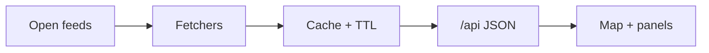

# Global Monitor


**Illustration only.** Scores and figures drawn in this artwork — conflict intensity 8.7, extreme weather 6.2, flood risk 7.1, drought risk 5.6, population 668.45 M, displaced 2.37 M, temperature anomaly +1.32 °C, sea level +24.6 cm — are **not live telemetry**. They belong to the picture, not to the dashboard.

Public map: [globalmonitor.pages.dev](https://globalmonitor.pages.dev/) · static backup: [nonarkara.github.io/globalmonitor](https://nonarkara.github.io/globalmonitor/)

---

## 1. What this is

Global Monitor is an independent, open-source-intelligence map for reading conflict, climate, mobility, and policy signals as one operating picture. It is the flagship of a small civic suite built by Dr Non Arkaraprasertkul (architect, anthropologist, smart-city practitioner at Thailand’s depa) with Associate Professor Dr Poon Thiengburanathum (public ranking and urban-performance methodology). The live surface is a React + Vite + MapLibre dashboard with a thin cache API; it is funded for public research by PMUA, with supporting organisations depa / MDES / Smart City Thailand and execution by Axiom and ReTL. It is **not** a ministry product.

## 2. Philosophy / invitation

The civic gift is the **method**, not a brand. Fork it. Keep the sources visible. Prefer a system a non-engineer can still open.

- **Fork the method.** Each theatre (Middle East, Southeast Asia / Indo-Pacific, Thailand) is a camera and a set of open feeds, not a secret model. If you need a different country, a quieter map, or Thai-first copy, start from this repo rather than from a screenshot.
- **Civic transparency.** A closed intelligence product asks for trust. An open one earns it or gets corrected. Every live number should carry a source and an age; a figure without either is treated here as a defect.
- **Human-scale systems.** Google Sheets when Sheets will do. Public NASA tiles when a paid satellite contract would only prove cleverness. Fix the plain way, so someone who is not the author can still understand it.
- **Bilingual where it matters.** The product’s privacy notice includes a Thai PDPA summary. This README is English; Thai legal text lives in the About / Legal modal. เชิญให้แยกสาขาวิธีการ — เปิดแหล่งข้อมูลให้ตรวจได้ และบอกให้ชัดเมื่อตัวเลขเป็นการวัดจริงหรือเป็นแบบจำลอง

Dr Non’s own origin note is in the in-app Papers tab (`src/data/originEssay.js`): the work exists so a person deciding whether it is safe to send someone somewhere has observations to look at, not only a headline.

## 3. Ethical use

Use this for lawful research, education, and situational awareness. Do not present the output as official intelligence, military guidance, or a government product.

- **Measured vs modelled.** FIRMS thermal detections, AIS ship reports, ADS-B aircraft, USGS quakes, and NASA GIBS tiles are *observations* (with their own biases and gaps). Escalation composites, TimesFM event-count forecasts, AlphaEarth year-to-year change, and bundled JSON briefings are *modelled or compiled*. Label them that way when you republish.
- **Not an official government product.** GitHub describes this repo as an independent digital-economy and geopolitical OSINT map — not a depa product. No file in this repository documents a government endorsement. Do not add one in a fork unless that endorsement actually exists and is recorded here.
- **Attribute upstream data.** Conflict events, satellite detections, market prices, flights, and vessels come from third parties listed in [`src/data/dataSources.json`](src/data/dataSources.json). Each keeps its own licence, latency, and limits. Axiom Overwatch AIS is documented in-repo as CC-BY 4.0. Open [Data Provenance](https://globalmonitor.pages.dev/) from Tools → Data health on the live map, or read [`docs/HOW-IT-WORKS.md`](docs/HOW-IT-WORKS.md).
- **Do not operationalise a cache.** Feeds fail silently; stale values are served on purpose; absence of signal is not absence of danger. Cross-check primary sources before any decision that requires verified official information.

## 4. How the system works

Open data is fetched, cached with an expiry, and drawn on a map. Provenance travels with the payload.



Open feeds in this tree include ACLED, NASA FIRMS/GIBS, AIS, ADS-B, USGS, RSS, and the others listed in [`src/data/dataSources.json`](src/data/dataSources.json). Fetchers live in `server/lib` (local Node) and `functions/_lib` (Cloudflare Pages). Cache replies are live or stale, never silent; `/api` payloads carry `X-Tech-*` provenance headers into React + MapLibre.

Same-origin `/api/*` in production (Cloudflare Pages Functions). Locally, Vite on port **5180** proxies `/api` to a Node cache on **4000**. Optional keys in [`.env.example`](.env.example) enrich feeds; the UI still renders public fallbacks and snapshot files when keys are missing. Only endpoints that exist in `server/` and `functions/` are documented.

Longer architecture, source list, and Cloudflare caveats: [`docs/HOW-IT-WORKS.md`](docs/HOW-IT-WORKS.md).

## 5. How to run / fork

Requires **Node 20** (CI and Docker) and npm. No private endpoints are required.

```bash
git clone https://github.com/Nonarkara/globalmonitor.git
cd globalmonitor
npm install
npm run dev:stack
```

That script starts:

- frontend — Vite, `http://127.0.0.1:5180`
- API cache — Node, `http://127.0.0.1:4000` (`/api` proxied)

Copy [`.env.example`](.env.example) to `.env.local` only if you have your **own** keys from those public providers (Copernicus, AirLabs, OpenSky, ACLED, FIRMS, and so on). Do not invent or scrape keys. Leave the file empty and the dashboard still runs: public NASA GIBS tiles, snapshot GeoJSON, and browser-side fallbacks are in the tree.

Useful commands that actually exist in `package.json`:

| Command | What it does |
| --- | --- |
| `npm run dev:stack` | Local frontend + API together |
| `npm run dev` / `npm run api` | Frontend or API alone |
| `npm test` | Node test runner on `tests/*.test.mjs` |
| `npm run build` | Production static build to `dist/` |
| `npm run refresh:flights` | Rewrite the public-domain OpenSky safety snapshot |
| `npm run refresh:airports` | Rebuild OurAirports GeoJSON |

Cloudflare Pages is the documented host. GitHub Actions deploys `dist/` to project **`globalmonitor`** (`.github/workflows/cloudflare-pages.yml`). The npm script `deploy:pages` currently passes `--project-name asiawatch` — that is what the file says; a fork should point wrangler at **your** Pages project. Bind optional secrets in the host dashboard, never as `VITE_*` variables.

Sister public maps (separate repos, not this tree): [MEM by NON](https://nonarkara.github.io/mem-by-non), [War Monitor](https://middleeast-monitor.pages.dev).

## 6. License

This repository does **not** currently ship a `LICENSE` file; GitHub lists it as unlicensed.

In-product legal copy (`src/data/legalCopy.js`) states that the dashboard’s design, source architecture, and visual identity are the work of Dr Non Arkaraprasertkul and Associate Professor Dr Poon Thiengburanathum. Contact for permissions: [non@nonarkara.org](mailto:non@nonarkara.org).

Third-party datasets remain under their upstream licences. Attribute them when you republish. Forking the **method** (open feeds, visible provenance, measured vs modelled) is the invitation; do not treat this README as a grant of rights the repository has not declared.
